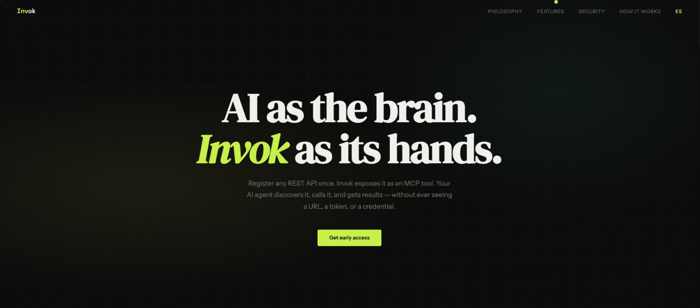

# Invok landing — guía de diseño y estructura

Documento de referencia para replicar o refactorizar esta landing en otro stack (React, Astro, etc.) manteniendo la misma jerarquía visual, tokens y patrones de interacción.

## Referencia visual (captura)

Esta carpeta incluye **img-reference.jpeg** junto a este archivo. En el IDE debería renderizarse como imagen debajo; sirve para alinear tono, densidad y jerarquía al refactorizar.

## Identidad visual

- **Estética:** fondo casi negro, superficies ligeramente más claras, acento **lima** (`#c8f04a`) y secundario **menta** (`#4af0c8`) usado con moderación.
- **Sensación:** producto técnico, “bridge” entre IA y APIs; tipografía serif en titulares para contraste con UI monospace en etiquetas y marca.
- **Detalle de textura:** overlay de **ruido SVG** fijo sobre `body` (`opacity` baja) para evitar el flat puro del negro.

## Tokens CSS (`:root`)

| Token | Uso típico |
|--------|------------|
| `--bg` `#0a0a0a` | Fondo principal |
| `--surface` `#111111` | Paneles, tarjetas |
| `--surface2` `#1a1a1a` | Hover de tarjetas |
| `--border` `#222222` | Bordes y rejillas |
| `--accent` `#c8f04a` | CTA, highlights, logo parcial, cursores |
| `--accent2` `#4af0c8` | Acento secundario (código, gradientes suaves) |
| `--text` `#f0f0ec` | Texto principal |
| `--muted` `#666660` | Subtítulos y cuerpo secundario |
| `--danger` `#f04a4a` | Estados de error / código “redacted” |

Mantener estos valores como **fuente única de verdad** al migrar (CSS variables, theme de Tailwind, etc.).

## Tipografía

Cargar desde Google Fonts (o self-host equivalente):

- **DM Serif Display** — `h1` hero, `.section-title`, títulos de filosofía y CTA.
- **DM Mono** — `.nav-logo`, `.section-label`, badges, números de lista seguridad, pie técnico.
- **Instrument Sans** — `body`, párrafos, botones, tarjetas.

**Jerarquía:**

- Etiqueta de sección: `.section-label` — mono, pequeño, uppercase, letter-spacing amplio, color `--accent`.
- Título de sección: `.section-title` — serif, `clamp` para responsive.
- Descripción: `.section-desc` — `--muted`, ancho máximo ~540px para legibilidad.

## Estructura de página (orden de secciones)

1. **Nav fijo** — logo textual (marca con parte del texto en `--accent`), enlaces ancla en mayúsculas pequeñas, botón de idioma.
2. **Hero** — altura mínima viewport, centrado; fondo con gradientes radiales + rejilla enmascarada.
3. **Flow** (`#how`) — “Cómo funciona”: label + título + descripción + **rejilla de tarjetas** (pasos).
4. **Features** (`#features`) — fondo `--surface`, bordes horizontales; casos de uso en misma rejilla de tarjetas.
5. **Philosophy** (`#philosophy`) — bloque centrado + **tres pilares** en grid.
6. **Security** (`#security`) — lista numerada con estilo “check” en mono.
7. **Stack / pricing** — misma familia de tarjetas que features (rejilla 2 columnas).
8. **CTA** — titular serif + párrafo + botón primario.
9. **Footer** — logo + línea técnica (stack).

Los `id` deben coincidir con los `href` del nav (`#philosophy`, `#features`, `#security`, `#how`).

## Componentes clave

### Navegación

- `position: fixed`, borde inferior transparente → al scroll (`nav.scrolled`) fondo semitransparente + `backdrop-filter`.
- Enlaces: color `--muted`, hover a `--text`.

### Hero

- Capas: `.hero-bg` (gradientes) → `.hero-grid` (líneas 60px, máscara radial) → `.hero-content`.
- `.hero-badge`: pill con borde, punto animado (`pulse`).
- Botones: `.btn-primary` (fondo `--accent`, texto oscuro), `.btn-secondary` (borde, hover `--surface`).

### Rejilla de características (`.features-grid`)

- **Regla importante:** base `grid-template-columns: repeat(2, minmax(0, 1fr))` para evitar celdas vacías con 4 o 2 ítems.
- En **flow** (4 pasos), desde `1024px`: `repeat(4, minmax(0, 1fr))` para una fila de cuatro en desktop ancho.
- Contenedor con `gap: 1px`, `background: var(--border)` para líneas tipo “tabla”; tarjetas con `background: var(--surface)`.
- `.feature-card`: hover sube a `--surface2`; línea superior `--accent` con `::before` animada (`scaleX`).

### Filosofía (`.pillars`)

- Grid de 3 columnas en desktop; 1 columna en móvil.
- `.pillar .num`: número grande serif en color `--border` como decoración.

### Seguridad (`.security-list`)

- Ítems en flex; borde por fila; hover con tinte `--accent` muy suave.
- Columna “check”: texto tipo `01`, `02` en mono color `--accent` (no solo icono).

### CTA

- Fondo con gradiente radial desde abajo (`::before`).
- Titular con posible `<em>` en `--accent`.

## Internacionalización (EN/ES)

- `html` tiene clases `lang-en` o `lang-es` (y `lang` + `document.title` actualizados por JS al alternar).
- Cada cadena duplicada:  
  `……`
- CSS:  
  `html.lang-en .lang-es { display: none !important; }`  
  `html.lang-es .lang-en { display: none !important; }`

Al portar: mismo contrato de clases o sustituir por `i18n` con un solo nodo por locale.

## Interacción y motion

- **Cursor personalizado:** `body { cursor: none; }`, div `.cursor` fijo, `mix-blend-mode: exclusion`; clase `.hovering` en enlaces, botones, tarjetas y filas de seguridad.
- **Scroll reveal:** `IntersectionObserver` en `.feature-card`, `.pillar`, `.security-list li` (opacidad + `translateY`).
- **Hero:** animación `fadeUp` en badge, título, subtítulo y acciones (stagger por delay).

## Responsive

- Breakpoint principal listado: `max-width: 768px` — nav links ocultos (solo en esta demo; en producción valorar menú hamburguesa), secciones con menos padding, `.features-grid` a 1 columna, `.pillars` a 1 columna.

## Checklist para refactor en otro proyecto

- [ ] Tokens en variables/tema único.
- [ ] Fuentes: mismas familias o mapping explícito (serif/mono/sans).
- [ ] Orden de secciones y `id` de anclas alineados con el nav.
- [ ] Rejillas: 2 columnas por defecto; 4 columnas solo en flow ≥1024px.
- [ ] i18n: patrón dual-span o sistema de traducciones equivalente.
- [ ] CTAs primarios: mismo contraste (texto oscuro sobre `--accent`).
- [ ] Enlaces externos a la app: `target="_blank"` + `rel="noopener noreferrer"` si aplica.

## Archivo de referencia

La implementación actual vive en `index.html` (CSS y JS inline). Cualquier divergencia futura: **este archivo y `design.md` deberían actualizarse juntos**.
