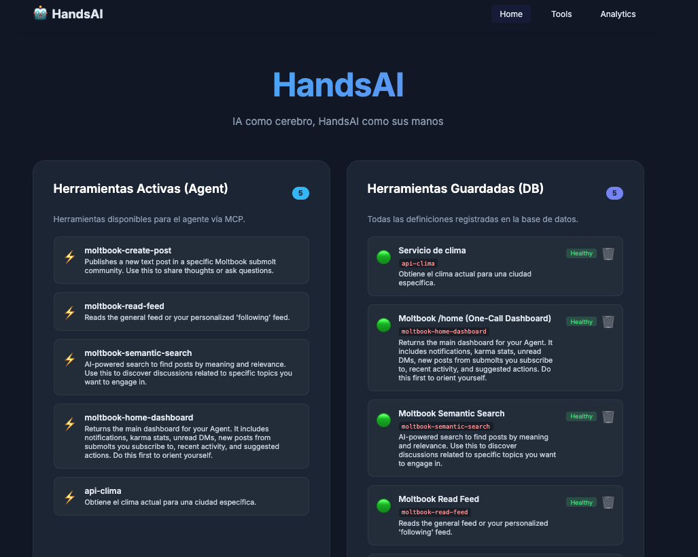
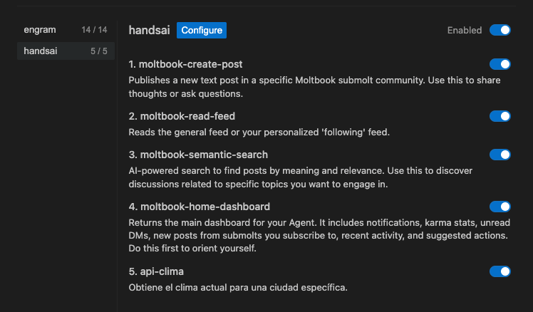
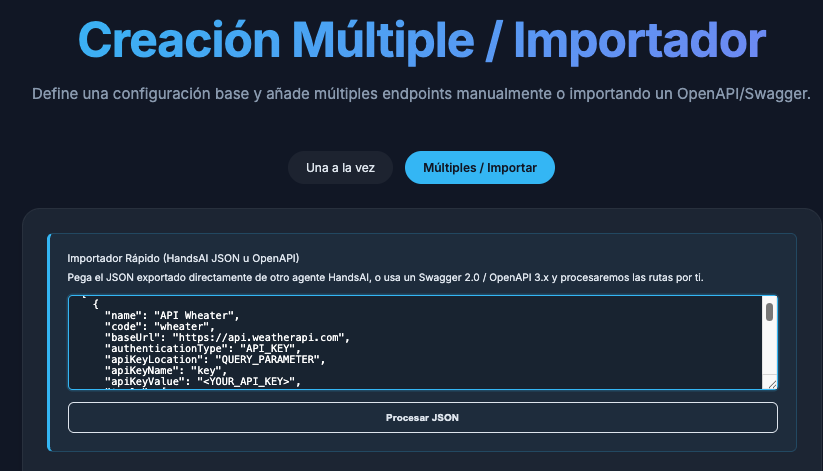

# Invok

**Stop writing boilerplate MCP servers and exposing private API keys to LLMs.** Invok is a language-agnostic dynamic tool proxy that instantly connects any AI agent to any REST API with native execution, zero-LLM-cost parsing, secure credential isolation, and granular context control.

<p align="center">
  
</p>

---

## What is Invok?

Invok is a lightweight, high-performance middleware that sits between AI agents/MCP clients (Claude Desktop, Claude Code, Cursor, Open WebUI, Hermes, Openclaw, etc.) and your production REST APIs. 

Instead of writing, hosting, and maintaining custom Model Context Protocol (MCP) servers for every API you want your agent to use, Invok serves as a single, universal bridge. You define the target API structure via Swagger/OpenAPI or JSON recipes, and Invok exposes them to your agent dynamically.

```
       ┌────────────────────────────────────────────────────────┐
       │                       AI Client                        │
       │ (Claude Desktop, Cursor, Claude Code, Open WebUI, etc.)│
       └───────────────────────────┬────────────────────────────┘
                                   │
                                   │ 1. Discover Tools / Call Tool
                                   │    (Standard MCP over Stdio/HTTP)
                                   ▼
       ┌────────────────────────────────────────────────────────┐
       │                   Invok Proxy/Server                   │
       │                                                        │
       │  [Programmatic Parser]  [Granular Context Filter]      │
       │  (0% LLM Token Cost)     (Reduce prompt noise)         │
       │                                                        │
       │  [Jasypt Secure Credential Injector]                   │
       │  (Tokens isolated from LLM context)                    │
       └───────────────────────────┬────────────────────────────┘
                                   │
                                   │ 2. Safe API Request
                                   │    (Injected headers, bearer tokens, params)
                                   ▼
       ┌────────────────────────────────────────────────────────┐
       │                     Production API                     │
       │           (Odoo CRM, Trello, HubSpot, etc.)            │
       └────────────────────────────────────────────────────────┘
```

---

## Invok Cloud (Hosted & Analytics)

Need detailed execution analytics, full request/response traceability, team collaboration, and hosted infrastructure? Try **[Invok Cloud](https://useinvok.run)**—the commercial, production-ready version of Invok.

---

## How It Works

### 1. Programmatic Parser (0% LLM Token Cost)
Unlike setups that feed raw API documentation or JSON-LD files into an LLM to let the model figure out how to structure requests, Invok handles parsing **entirely in native code**. 
- It reads OpenAPI/Swagger specifications programmatically and maps them to clean tool schemas.
- It compiles tool definitions instantly with **zero LLM inference overhead**.
- The AI agent receives standard, pre-formatted JSON schemas for tool definitions, ensuring sub-millisecond local execution without wasting model tokens.

### 2. Granular Context Control
Exposing a complete enterprise API (e.g., Odoo, HubSpot) with hundreds of endpoints to an LLM will quickly blow past its context window, inflate prompt billing, and cause tool-calling hallucinations.
- Invok lets you selectively toggle which endpoints are exposed as tools.
- Curate exactly what your agent sees (e.g., exposing only 15 critical CRM endpoints out of 100).
- This keeps the agent's prompt clean, lowers token usage costs dramatically, and keeps tool calling highly accurate.

### 3. Security and Token Isolation
AI models should never touch, process, or see your private credentials.
- **Authentication Bypass**: The LLM only receives the tool metadata and parameter definitions. It has no visibility into API Keys, Bearer tokens, or basic auth passwords.
- **Backend Injection**: Invok intercepts tool calls from the client, decrypts stored credentials at rest (secured using Jasypt encryption), injects the credentials into the requests on the server side, and forwards the calls to the production API.
- **Zero Exposure**: Your API keys never leave the server running Invok, keeping your production tokens completely isolated from LLM logs or third-party AI provider context.

---

## Portability & Distribution (JSON Recipes)

Invok introduces the concept of **Portable Tool Recipes**. 
Once you curate a set of tools for a complex API (mapping JSON-RPC structures, parameter descriptions, and custom headers), you can export the configuration as a clean, secret-free JSON file.

```
                  [ Curate Tools in Invok UI ]
                               │
                               ▼
               [ Export Tool Recipe (JSON) ]
                (Automatically strips keys)
                               │
              ┌────────────────┴────────────────┐
              ▼                                 ▼
      [ Share with Team ]              [ Version in Git ]
              │                                 │
              ▼                                 ▼
    [ Import in 30 Seconds ]         [ Run in CI/CD / Prod ]
   (Input local private keys)
```

This allows teams to:
- Share pre-configured integrations for internal tools instantly.
- Version-control agent capabilities inside the git repository.
- Distribute ready-to-use API bundles to clients without exposing production credentials.

---

## Highlighted Use Case: Odoo CRM

Odoo utilizes a complex JSON-RPC structure for database operations. Feeding these raw POST payloads to an LLM is error-prone. 

Invok abstracts this complexity. For example, Odoo's CRM query endpoint (`/json/2/crm.lead/search_read`) requires a database header, database name, and structural JSON payload. 

With Invok, this is mapped into a single, clean tool `odoo-crm-list`. 

### The Tool Definition Recipe:
```json
{
  "name": "CRM - List Opportunities",
  "code": "odoo-crm-list",
  "description": "Lists active CRM opportunities returning name, company, stage, and probability.",
  "endpointPath": "/json/2/crm.lead/search_read",
  "httpMethod": "POST",
  "bodyPayloadTemplate": "{\"domain\": [], \"fields\": [\"name\", \"partner_name\", \"email_from\", \"stage_id\", \"probability\", \"expected_revenue\"], \"limit\": {{limit}}}",
  "parameters": [
    {
      "name": "limit",
      "type": "NUMBER",
      "description": "Maximum number of opportunities to retrieve.",
      "required": false,
      "defaultValue": "10"
    }
  ]
}
```

### The LLM Interaction:
Instead of writing complex JSON-RPC structures, the LLM simply calls:
```json
{
  "name": "odoo-crm-list",
  "arguments": { "limit": 5 }
}
```
Invok automatically:
1. Intercepts the call.
2. Injects custom database headers (e.g., `X-Odoo-Database`).
3. Injects the Bearer Authorization token securely.
4. Renders the body payload template: replacing `{{limit}}` with `5`.
5. Executes the request against Odoo, parsing and returning the raw JSON response to the agent.

---

## Getting Started

### 1. Run Invok
You can run Invok locally or via Docker. The server runs on `http://localhost:8080` and configures a local SQLite database at `data/invok.db` automatically.

#### Using Docker
```bash
docker compose up
```

#### Running Locally (Java 21 required)
```bash
./mvnw spring-boot:run
```

Once running, navigate to `http://localhost:8080` to manage your providers and tools via the visual dashboard.

---

## Connect to an MCP Client

### Method A: Streamable HTTP (Remote / Direct)
Most modern MCP clients support Streamable HTTP. Configure your agent to connect directly to the HTTP server:

```json
{
  "mcpServers": {
    "invok": {
      "type": "streamable-http",
      "url": "http://localhost:8080/mcp"
    }
  }
}
```

### Method B: Stdio Bridge (Local CLI)
If your client only supports stdio-based subprocess communication (like Claude Desktop or Cursor), download the [Invok Bridge Release](https://github.com/Vrivaans/handsai-bridge/releases) for your OS and configure it.

**Claude Desktop** (`claude_desktop_config.json`):
```json
{
  "mcpServers": {
    "invok": {
      "command": "/path/to/invok-mcp",
      "args": ["mcp"]
    }
  }
}
```

**VS Code** (`.vscode/settings.json`):
```json
{
  "mcp": {
    "servers": {
      "invok": {
        "command": "/path/to/invok-mcp",
        "args": ["mcp"]
      }
    }
  }
}
```

Create a `config.json` file in the same directory as the `invok-mcp` binary:
```json
{
  "invokUrl": "http://localhost:8080/"
}
```

<p align="center">
  
</p>

---

## Declarative API Management

### Create a Provider
```bash
curl -X POST http://localhost:8080/api/providers \
  -H "Content-Type: application/json" \
  -d '{
    "name": "HubSpot",
    "code": "hubspot",
    "baseUrl": "https://api.hubapi.com",
    "authenticationType": "BEARER_TOKEN",
    "apiKeyLocation": "HEADER",
    "apiKeyName": "Authorization",
    "apiKeyValue": "your-bearer-token"
  }'
```

### Create a Tool manually
```bash
curl -X POST http://localhost:8080/api/tools \
  -H "Content-Type: application/json" \
  -d '{
    "name": "Get Contacts",
    "code": "get_contacts",
    "description": "Retrieve contact records from HubSpot CRM",
    "providerId": 1,
    "endpointPath": "/crm/v3/objects/contacts",
    "httpMethod": "GET",
    "parameters": [
      { "name": "limit", "type": "NUMBER", "required": false }
    ]
  }'
```

### Import from Swagger / OpenAPI spec
Paste raw OpenAPI/Swagger schemas directly to batch-generate tools. Invok programmatically parses and registers all paths, parameters, and query options.
```bash
curl -X POST http://localhost:8080/api/import \
  -H "Content-Type: application/json" \
  -d @openapi-spec.json
```

<p align="center">
  
</p>

---

## Portable Use-Cases

Invok ships with pre-configured templates under [`docs/casos-de-uso/`](docs/casos-de-uso/):

| Integration | File / Guide | Description |
|-------------|--------------|-------------|
| **Odoo** | [Odoo Integration](docs/casos-de-uso/Odoo.md) | Standard CRM/ERP actions operated via natural language |
| **Trello** | [Trello Integration](docs/casos-de-uso/Trello.md) | Manage boards, lists, and cards dynamically |
| **Crypto APIs** | [APIs Crypto JSON](docs/casos-de-uso/APIS_PUBLICAS_CRYPTO.json) | Direct import for Coinbase, Binance, and CoinGecko |
| **VPS Management**| [VPS Status JSON](docs/casos-de-uso/CUBEPATH_VPS_STATUS.json) | Monitor VPS status and performance directly from agents |
| **Weather** | [Weather API](docs/casos-de-uso/CLIMA.md) | Multi-provider weather retrieval |

*To import any of these, simply run `POST /api/import` containing the raw JSON content of the recipe.*

---

## API Endpoint Reference

| Method | Endpoint | Description |
|--------|----------|-------------|
| `GET` | `/api/providers` | List all registered API providers |
| `POST` | `/api/providers` | Register a new API provider |
| `PUT` | `/api/providers/{id}` | Update provider details |
| `DELETE` | `/api/providers/{id}` | Remove a provider |
| `GET` | `/api/tools` | List all registered tools |
| `POST` | `/api/tools` | Register a new tool |
| `PUT` | `/api/tools/{id}` | Update tool parameters or metadata |
| `DELETE` | `/api/tools/{id}` | Remove a tool |
| `POST` | `/api/tools/{id}/validate` | Perform health check on a tool endpoint |
| `POST` | `/api/tools/batch` | Batch register multiple tools |
| `POST` | `/api/tools/call` | Directly execute a tool (internal testing) |
| `POST` | `/api/import` | Import tool recipes or OpenAPI specs |
| `GET` | `/api/export` | Export entire tool configuration as a recipe |
| `GET` | `/api/guide` | Access integration guidelines (`invok_guide` tool schema) |
| `POST` | `/mcp` | Standard JSON-RPC Endpoint (Streamable HTTP) |
| `GET` | `/mcp/tools/list` | Legacy bridge tools listing |
| `POST` | `/mcp/tools/call` | Legacy bridge tools execution |

---

## Environment Variables

| Variable | Default | Description |
|----------|---------|-------------|
| `PORT` | `8080` | Server port |
| `JASYPT_ENCRYPTOR_PASSWORD` | `invok-oss-default-key` | Secret key used for Jasypt symmetric encryption of stored credentials |
| `invok.health-check.enabled` | `false` | Enable periodic background health checking of registered endpoints |

---

## Tech Stack

- **Java 21 LTS** with Virtual Threads support enabled
- **Spring Boot 3.5.4** framework
- **SQLite Database** managed via Hibernate Community Dialects
- **Jasypt** for symmetric encryption of credentials at rest
- **Angular 19** clean administration Dashboard with English and Spanish locale support
- **GraalVM Native Image** compatibility for native sub-second execution
- **Docker** support out of the box

---

## License

This project is licensed under the **GNU Affero General Public License v3 (AGPL-3.0)**.
